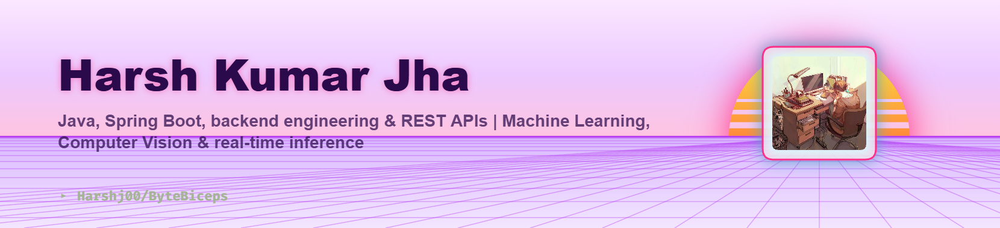

<picture>
   <source media="(prefers-color-scheme: dark)" srcset="art/header-dark.png">
   
</picture>

 

# ✧ Harsh Kumar Jha ✧

 

 

---

## 𓀋 About Me

<table>
<tr>
<td width="65%" valign="middle">

### Hey! I'm Harsh 👨‍💻

I'm a **Software Developer & AI/ML Engineer** passionate about turning ideas into useful, scalable, and visually polished software.

- Building projects across **Full-Stack Development, AI/ML & Backend Engineering**
- Working primarily with **Java, Python & Spring Boot**
- Exploring **Artificial Intelligence, Machine Learning & Generative AI**
- Comfortable working with **SQL, PostgreSQL & MySQL**
- Interested in **clean architecture, scalable systems & developer tools**
- I enjoy transforming concepts into **real-world applications**
- Constantly learning, experimenting, and improving
 

> **"Build. Break. Learn. Repeat."**

</td>

<td width="35%" align="center" valign="middle">

  

**✵✵✵✵✵✵✵✵✵✵**

</td>
</tr>
</table>

---

## ⚡ Tech Stack

### Languages

  

### Frameworks & Development

  

### AI / ML & Data

  

### Databases, Cloud & Tools

---

## 📊 GitHub Analytics

  

 

## 📈 Contribution Activity

---

## 🐍 Contribution Snake

<!--
  SNAKE ANIMATION
  GitHub Action:
  https://github.com/Platane/snk
-->

<picture>
  <source media="(prefers-color-scheme: dark)" srcset="https://raw.githubusercontent.com/Harshj00/Harshj00/output/github-contribution-grid-snake-dark.svg">
  <source media="(prefers-color-scheme: light)" srcset="https://raw.githubusercontent.com/Harshj00/Harshj00/output/github-contribution-grid-snake.svg">
  
</picture>

<!--
  ╔════════════════════════════════════════════════════════════════════════╗
  ║                     SNAKE GITHUB ACTION                                ║
  ╚════════════════════════════════════════════════════════════════════════╝

  Create:
  .github/workflows/snake.yml

  Then add:

  name: Generate Snake

  on:
    schedule:
      - cron: "0 0 * * *"
    workflow_dispatch:

  jobs:
    generate:
      runs-on: ubuntu-latest
      steps:
        - uses: Platane/snk@v3
          with:
            github_user_name: ${{ github.repository_owner }}
            outputs: |
              dist/github-contribution-grid-snake.svg
              dist/github-contribution-grid-snake-dark.svg?palette=github-dark

        - uses: crazy-max/ghaction-github-pages@v4
          with:
            build_dir: dist
          env:
            GH_PAT: ${{ secrets.GITHUB_TOKEN }}
            BUILD_DIR: dist
-->

---

## 🚀 Featured Projects

 

---

## 🤝 Connect With Me

 

### Let's build something awesome together. 🖤

 

<!-- ═══════════════════════════════════════════════════════════════════════ -->
<!--                           PREMIUM FOOTER                                -->
<!-- ═══════════════════════════════════════════════════════════════════════ -->

